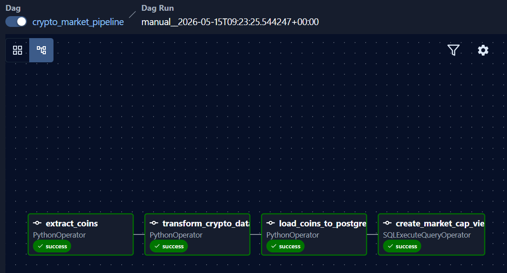
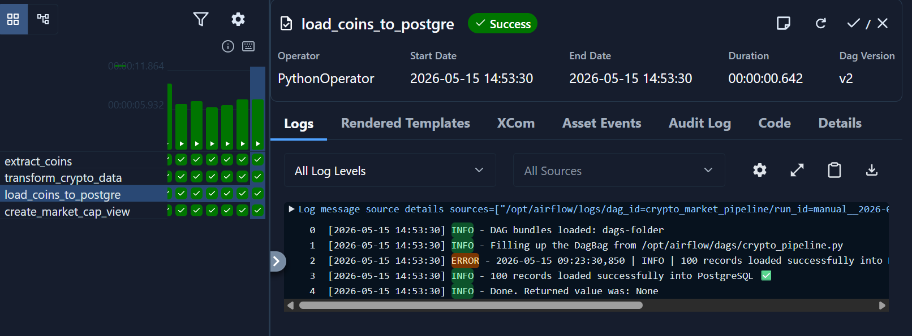
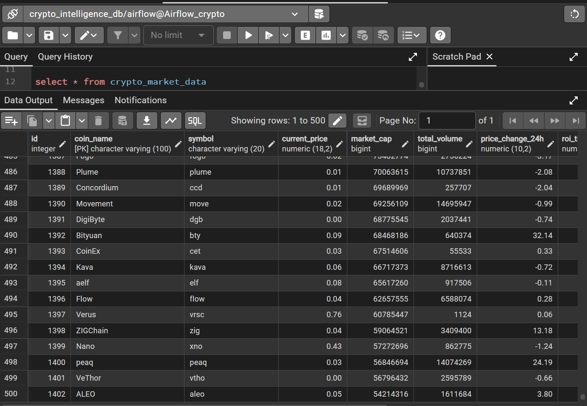
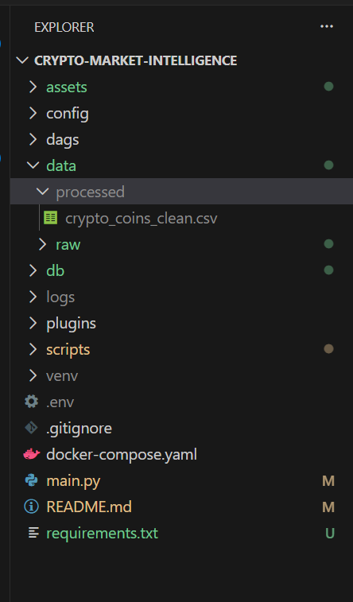

# 🚀 Crypto Market Intelligence Pipeline

A production-style ETL pipeline built using Python, Apache Airflow, PostgreSQL, and Docker to ingest and analyze cryptocurrency market data.

---

# 📌 Project Overview

This project extracts cryptocurrency market data from the CoinGecko API, transforms the data using pandas, stores historical snapshots in PostgreSQL, and orchestrates the workflow using Apache Airflow.

---

# 🏗️ Architecture

CoinGecko API
↓
Python Extraction
↓
Data Transformation (pandas)
↓
PostgreSQL
↓
Airflow DAG Orchestration
↓
SQL Analytics

---

# ⚙️ Tech Stack

- Python
- Apache Airflow
- PostgreSQL
- Docker
- pandas
- SQLAlchemy
- CoinGecko API

---

# 🔄 Pipeline Flow

1. Extract cryptocurrency market data from CoinGecko API
2. Transform and clean data using pandas
3. Store historical snapshots in PostgreSQL
4. Schedule daily ingestion using Airflow
5. Create analytics views using SQL

---

# 📊 Features

- Automated ETL pipeline
- Airflow DAG orchestration
- PostgreSQL integration
- Historical crypto data storage
- Retry handling and logging

# 🚀 Running the Project

## Start Airflow

```bash
docker compose up
```

## Open Airflow UI

```text
http://localhost:8080
```

---

# 🔐 Airflow Connection

Create PostgreSQL connection in Airflow UI:

- Connection ID: `crypto_postgres`
- Host: `postgres`
- Database: `crypto_intelligence_db`

## Project Screenshots







